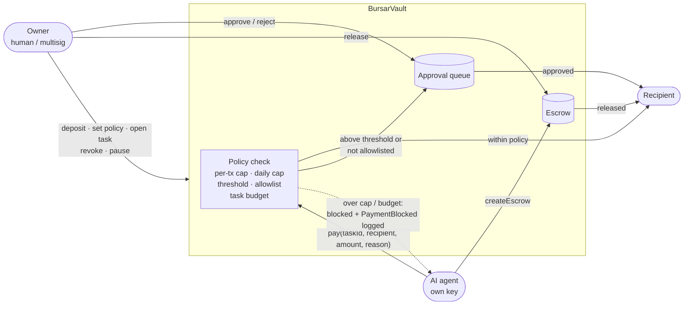
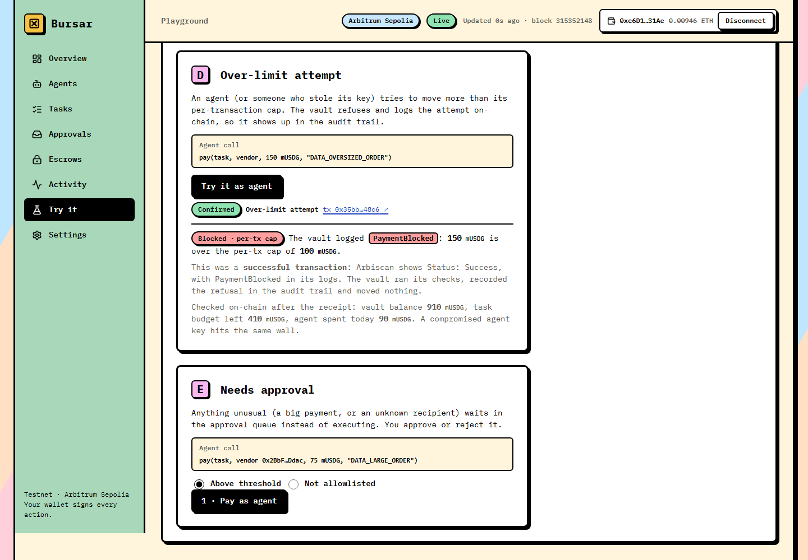
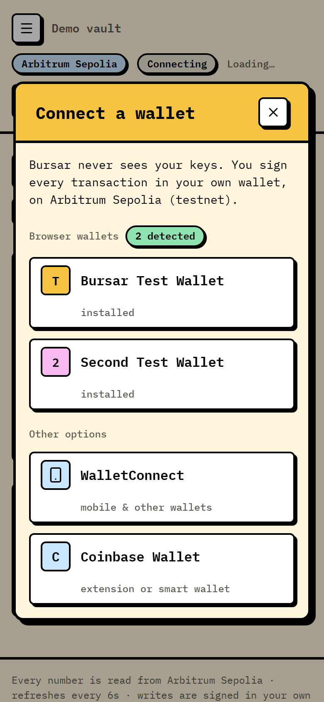

# Bursar

**A treasury and policy layer for AI agents: agents spend stablecoins from a vault, but only within rules enforced by smart contracts.**

Live on **Arbitrum Sepolia (chain id 421614)**. All contracts are verified on Arbiscan.

**Try it:** [trybursar.vercel.app](https://trybursar.vercel.app/), with the landing page, [live dashboard](https://trybursar.vercel.app/dashboard) and [agent playground](https://trybursar.vercel.app/try).

---

## The problem

AI agents increasingly need to spend money: paying for APIs and data, buying services, paying other agents. Today there are two bad options:

- **Give the agent an open wallet or key.** One bug, one prompt injection or one leaked key can drain everything the key controls.
- **Approve every payment by hand.** It's safe, but it removes the autonomy that makes an agent useful.

Neither gives you a clean, per-task audit trail of what an agent spent, on what and why.

## The solution

Bursar sits between the money and the agents:

1. **The owner funds a vault** with a stablecoin (USDG, 6 decimals) and stays in control of it.
2. **Each agent gets its own key and a policy:** a per-transaction cap, a daily cap, and an approval threshold.
3. **Spending is tied to tasks.** The owner opens a task with a budget and an expiry. That budget is reserved, and the agent can only spend against it.
4. **Recipients are allowlisted,** per agent or vault-wide.
5. **Anything unusual waits for a human.** A payment above the threshold, or to an address that isn't allowlisted, goes into an **approval queue** instead of executing.
6. **Escrow** lets an agent lock funds for a payee. The owner (or a designated approver) releases them; after a deadline they can be refunded to the vault.
7. **Instant kill switches:** the owner can revoke a single agent or pause the whole vault.
8. **Audit trail:** every state-changing action emits an event with the agent, task, recipient, amount and a `bytes32` reason code.

The rules live in the contracts. An agent with a compromised key can do no more than its policy, its task budget and its allowlist permit.



---

## Deployed contracts (Arbitrum Sepolia)

From [`deployments/arbitrum-sepolia.json`](deployments/arbitrum-sepolia.json) (v2; the v1 deployment is archived in [`deployments/arbitrum-sepolia.v1.json`](deployments/arbitrum-sepolia.v1.json)):

| Contract / role | Address | Verified |
|---|---|---|
| BursarFactory | [`0x8Ab9F56B8dE7dcB8F6FFAB2F02AF4E1A1cEcb7C2`](https://sepolia.arbiscan.io/address/0x8Ab9F56B8dE7dcB8F6FFAB2F02AF4E1A1cEcb7C2) | ✅ |
| MockUSDG (6 decimals, testnet mock) | [`0xF7a631d39aFE37290A500Edcae7C64aA19Ed8524`](https://sepolia.arbiscan.io/address/0xF7a631d39aFE37290A500Edcae7C64aA19Ed8524) | ✅ |
| BursarVault (demo, created by the factory) | [`0x822Cb3724d64870F6659ceca26534de8f5BD3840`](https://sepolia.arbiscan.io/address/0x822Cb3724d64870F6659ceca26534de8f5BD3840) | ✅ |
| Vault owner / deployer | [`0x4526144B69a6380818B8b118E4F383e0523E1B28`](https://sepolia.arbiscan.io/address/0x4526144B69a6380818B8b118E4F383e0523E1B28) | n/a (wallet) |
| Demo agent | [`0x2ADbae68aA757811b3c4f29CE55873Fe5A800E07`](https://sepolia.arbiscan.io/address/0x2ADbae68aA757811b3c4f29CE55873Fe5A800E07) | n/a (wallet) |
| Demo recipient (allowlisted for the agent) | [`0xE5843118b8E82Fa58fe2d022128a55527C3a5f1B`](https://sepolia.arbiscan.io/address/0xE5843118b8E82Fa58fe2d022128a55527C3a5f1B) | n/a (wallet) |

The demo agent's policy: per-tx cap **100**, daily cap **500**, approval threshold **50** (mUSDG), role `DEMO`. Task `demo-task-1` has a budget of **1,000** mUSDG.

## Live demo results

These are real transactions from the run recorded in [`docs/demo-run.txt`](docs/demo-run.txt), produced by the scripts in [`agent/`](agent/README.md):

| Step | Transaction | What it proves |
|---|---|---|
| Direct payment, 25 mUSDG | [`0x1814…133b`](https://sepolia.arbiscan.io/tx/0x1814efae9fa8b347fe9a5b66ef8cbc29897b8e4879e0ebf4017ef5f86982133b) | The agent pays an allowlisted recipient on its own when the amount is within policy |
| Over-cap attempt, 150 mUSDG | [`0xcc2e…ade3`](https://sepolia.arbiscan.io/tx/0xcc2e8f1f4d32e45c1c9f94c6e14255ca29bb554fd116d3bb3e5f5cdd4921ade3) | A **successful** transaction that emits `PaymentBlocked` (cause `PerTxCap`): Arbiscan shows Status: Success with the event in the logs. Nothing moved, but the attempt is in the audit trail. |
| Above-threshold payment, 75 mUSDG | [`0x0989…24e6`](https://sepolia.arbiscan.io/tx/0x0989779e0fd47aaf44ddf42e951ea7c8afdaaa71a06167b273b3ab143a0624e6) | Lands in the approval queue as request #1 (cause: threshold); no funds move |
| Escrow created, 40 mUSDG | [`0xf063…a888`](https://sepolia.arbiscan.io/tx/0xf06339be99ce43ee5e7775d8883d79ae6dc5fa3271c739f2779bbcde62b5a888) | Funds are locked from the task budget for the payee |
| Request #1 approved (owner) | [`0xc591…3341`](https://sepolia.arbiscan.io/tx/0xc591786009436b65dfee91ea3a50edf7efab6f843e8bfe7c64019d1f263a3341) | The owner's sign-off executes the queued payment; it doesn't count toward the agent's daily cap |
| Escrow #1 released (owner) | [`0x7996…3c2a`](https://sepolia.arbiscan.io/tx/0x7996fc4c5bc3f0478033f0a20702f75c0484b2dbd08ed2c3dd853dcd20543c2a) | The owner releases the escrow to the payee |

**End state:**
- **Recipient:** received 140 mUSDG (25 + 75 + 40).
- **Vault:** 10,000 → 9,860 mUSDG.
- **Agent:** 65 of its 500 daily cap used (the approved 75 isn't counted).
- **Task:** 860 of 1,000 left.

### AI agent run (Claude over MCP)

Claude, acting as the agent through the Bursar MCP server ([`agent-mcp/`](agent-mcp/README.md)), made these transactions. The full transcript is in [`docs/ai-agent-run.txt`](docs/ai-agent-run.txt):

| Agent action | Transaction | Vault outcome |
|---|---|---|
| Buy data, 20 mUSDG (`DATA_MARKET_PRICES`) | [`0x70ca…6478`](https://sepolia.arbiscan.io/tx/0x70ca5c2f03bdb9088ea9a871be2701597f2d2a29f407bf4842f23426c7096478) | **Paid** (`PaymentExecuted`) |
| Bulk order, 75 mUSDG (`DATA_BULK_ORDER`) | [`0xb086…cf4a`](https://sepolia.arbiscan.io/tx/0xb0866e8522628d549aeb09c1cd7bf4572f9c66afbe960078cddf97893d4bcf4a) | **Queued** as request #2 (above the 50 threshold) |
| Premium dataset, 150 mUSDG (`DATA_PREMIUM_DATASET`) | [`0x528e…3ebc`](https://sepolia.arbiscan.io/tx/0x528e2fba55b9cec081910ade4cb85b38ec8365e89e334a13225e0000cc0f3ebc) | **Blocked** (`PaymentBlocked`, per-tx cap), no funds moved |

---

## Dashboard and playground

A keyless web app is in [`web/`](web/README.md) (Vite, React, viem, wagmi). It reads the chain directly, and any write is signed by the user's own wallet (injected/EIP-6963, WalletConnect or Coinbase Wallet).

- **Dashboard:** the vault's balance, agents, tasks, approval queue, escrows, and an activity feed that includes blocked attempts and config events. It has filters, use-case labels from reason-code prefixes, and a 7-day spend chart.
- **Owner console:** the vault owner can approve or reject requests, release escrows, edit policies and pause the vault.
- **Playground (`/try`):** create your own vault with the factory and run the paid, queued and blocked scenarios as real transactions.

| Dashboard | Playground: a blocked payment | Wallet modal (phone) |
|---|---|---|
|  |  |  |

More screenshots are in [`docs/screenshots/`](docs/screenshots/).

## USDG

The live deployment uses MockUSDG. The official Paxos USDG testnet contract on Arbitrum Sepolia was checked on-chain (Global Dollar, 6 decimals). No real USDG payment has been tested, because the faucet couldn't be reached from this environment. Details are in [`docs/usdg-report.md`](docs/usdg-report.md).

---

## Policy model and security

### What the contracts enforce

Each agent has `Policy { perTxCap, dailyCap, approvalThreshold, active, role }`, with `0 < perTxCap <= dailyCap` and `approvalThreshold <= perTxCap`. `approvalThreshold == 0` means every payment needs approval.

An agent's `pay(taskId, recipient, amount, reason)` goes through these checks in order:

1. The vault is not paused and the agent is active.
2. The task is open, unexpired and belongs to the agent, otherwise it reverts.
3. Over the per-tx cap or the task budget: **blocked**. `pay` emits `PaymentBlocked` and returns `(false, 0)` with no state change, so the attempt stays in the audit trail (a revert would leave no record). The transaction itself succeeds.
4. If the recipient is not allowlisted, or `amount > approvalThreshold`, the payment is **queued**. It reserves nothing and doesn't count toward the daily cap.
5. Otherwise, if the daily cap allows it, the payment executes; if not, it is **blocked** (`PaymentBlocked`, cause `DailyCap`). Return values: `(true, 0)` paid, `(false, id)` queued, `(false, 0)` blocked. `createEscrow` still reverts on limits.

Other rules:

- **Approvals** re-check that the agent is active, the task is open and unexpired, the budget covers the amount, and the vault is not paused. Approved payments don't count toward the daily cap.
- **Escrow** counts toward `perTxCap` and `dailyCap` like a direct payment, but skips the allowlist and threshold, because release itself needs the owner or approver. After the deadline anyone can refund it to the vault's free balance.
- **Tasks** are opened by the owner only. Their ids can never be reused. The owner can close a task at any time, and anyone can close it once it has expired.
- **Accounting:** `totalReserved = Σ open task budgets + Σ locked escrows`, and `freeBalance = balance − totalReserved`. Only free funds can be withdrawn or reserved for new tasks.
- **Pause** freezes `pay`, `createEscrow`, `approveRequest` and `releaseEscrow`. These still work while paused, so the owner can always exit: `deposit`, `withdraw`, `closeTask`, `refundEscrow`, `rejectRequest`, `revokeAgent` and the config setters.
- **Implementation:**
  - SafeERC20 for every transfer, and checks-effects-interactions with `nonReentrant` on every function that moves tokens.
  - Custom errors throughout.
  - No unbounded loops in state-changing functions; lists are read through paginated views.
  - Two-step ownership transfer, and `renounceOwnership` is disabled.

### Threat model (each item is covered by tests)

| Actor | Attempts that are tested and blocked |
|---|---|
| Malicious agent | Splitting payments to dodge the per-tx cap (the daily cap stops it); spending on another agent's task; spending after revoke, expiry or pause; reusing a closed task id; paying itself; using owner-only functions; flooding the queue to lock funds (queued requests reserve nothing) |
| Owner | Withdrawing reserved or escrowed funds; approving an expired request, after the task closed, or beyond the task budget; refunding an escrow before its deadline |
| Malicious token or recipient | Re-entering `pay`, `approveRequest`, `releaseEscrow` and `withdraw` mid-transfer (blocked by the reentrancy guard); a recipient the token has blocklisted |

### Documented assumptions

- **The owner should be a multisig** for real deployments. Reservations prevent double-spending; they don't protect agents from the owner, who can close tasks early and withdraw anything not in escrow.
- **The approver must be a trusted party and never an agent key.** Agents choose escrow payees freely, including addresses they control. Set the approver to `address(0)` to make releases owner-only.
- **Fee-on-transfer and rebasing tokens are unsupported.** The vault assumes a transfer of `x` moves exactly `x`.
- **Up to 2× the daily cap around UTC midnight.** The daily cap uses fixed UTC days (`block.timestamp / 1 days`), so an agent can spend its full cap just before midnight and again just after. A rolling window would need per-payment history. If 2× is too much, set `dailyCap` to half your real 24-hour tolerance.
- **Blocklisted recipients:** if the token blocks a recipient, the transfer reverts and the whole call rolls back:
  - **`pay`:** nothing changes.
  - **`approveRequest`:** the request stays pending, and the owner can reject it.
  - **`releaseEscrow`:** the escrow stays locked, and it can be refunded after its deadline.
  - **The vault itself:** if the vault were blocklisted, no transfers out would work.

---

## Tests

From an actual run of `forge test` (Foundry 1.7.1): **203 tests, 203 passed, 0 failed**, across 9 suites.

| Suite | Tests | Covers |
|---|---|---|
| `test/BursarVault.t.sol` | 145 | Every function, every custom error, every event |
| `test/Adversarial.t.sol` | 18 + 4 + 4 | Malicious agent, owner overreach, step-by-step accounting scenario; reentrant token; blocklisting token |
| `test/BursarVault.fuzz.t.sol` | 5 | Daily cap across day boundaries, the 2×-around-midnight tradeoff, per-tx cap, task budget accounting, total paid out ≤ deposits (1,000 runs each) |
| `test/invariant/` | 4 | Handler with ghost variables (256 runs × 100 calls): balance ≥ reserved; reserved = Σ tasks + Σ escrows; daily autonomous spend ≤ dailyCap; balance = deposits − outflows |
| `test/Scripts.t.sol` | 10 | Deploy and Seed scripts run end to end |
| `test/BursarFactory.t.sol` | 4 + 1 | Factory; MockUSDG |

Coverage, from `forge coverage --report summary --no-match-coverage "(test|script)/"`:

| File | Lines | Statements | Branches | Functions |
|---|---|---|---|---|
| `src/BursarVault.sol` | 100% (220/220) | 100% (278/278) | 100% (51/51) | 100% (44/44) |
| `src/BursarFactory.sol` | 100% (6/6) | 100% (4/4) | n/a (0/0) | 100% (2/2) |
| `src/mocks/MockUSDG.sol` | 100% (4/4) | 100% (2/2) | n/a (0/0) | 100% (2/2) |
| **Total** | **100% (230/230)** | **100% (284/284)** | **100% (51/51)** | **100% (48/48)** |

---

## Run it yourself

### Build and test

```bash
git clone --recurse-submodules <repo-url>
cd Bursar
forge build
forge test
forge coverage --report summary --no-match-coverage "(test|script)/"
```

Dependencies are git submodules: OpenZeppelin Contracts v5.4.0 and forge-std. Foundry reads `.env` from the repo root automatically. Copy `.env.example` to `.env`; every variable is documented there.

### About the token

**USDG is the intended stablecoin.** The testnet deployment uses **MockUSDG**, a 6-decimal ERC-20 with a public `mint`, because it's testnet. The token is never hardcoded: it's a constructor parameter of each vault, and the deploy script reads it from configuration. To use real USDG, set `DEPLOY_MOCK_TOKEN=false` and `TOKEN_ADDRESS=<USDG address>` in `.env`. Both scripts refuse to deploy or mint the mock on Arbitrum One (chain id 42161).

### Deploy to Arbitrum Sepolia

Keys never go in `.env` or in the scripts. Sign with an encrypted Foundry keystore:

```bash
cast wallet import deployer --interactive
```

Fund the deployer with Arbitrum Sepolia ETH, set `ARBITRUM_SEPOLIA_RPC_URL` and `ARBISCAN_API_KEY` in `.env`, then:

```bash
# 1. Factory (+ MockUSDG when DEPLOY_MOCK_TOKEN=true). Drop --account/--broadcast/--verify and add --sender <addr> for a dry run.
forge script script/Deploy.s.sol --rpc-url arbitrum_sepolia --account deployer --broadcast --verify

# 2. Demo vault: set FACTORY_ADDRESS, TOKEN_ADDRESS, AGENT_ADDRESS and RECIPIENT_ADDRESS in .env first
forge script script/Seed.s.sol --rpc-url arbitrum_sepolia --account deployer --broadcast --verify
```

If `--verify` didn't cover a contract, verify it manually. The vault needs its constructor arguments:

```bash
forge verify-contract <VAULT_ADDRESS> src/BursarVault.sol:BursarVault --chain arbitrum-sepolia --watch \
  --constructor-args $(cast abi-encode "constructor(address,address)" <TOKEN_ADDRESS> <VAULT_OWNER>)
```

### Run the agent demo

The TypeScript/viem agent, owner and status scripts are in [`agent/`](agent/README.md). See [`agent/README.md`](agent/README.md) for setting `AGENT_PRIVATE_KEY` and running each script:

```bash
cd agent
npm install
npm run status     # read-only
npm run agent      # the 5-step agent story (signs with AGENT_PRIVATE_KEY from .env)
npm run owner      # approve + release (signs with the Foundry keystore)
```

### Run the AI agent (MCP)

```bash
cd agent-mcp
npm install
npm run build
cd ..
claude
```

The server is registered for this project in the repo-root `.mcp.json` (no secrets; it reads the agent key from `.env`). Approve `bursar` when Claude Code asks, check that `/mcp` shows it connected, then give it a task such as: *"Use the bursar tools. Check your policy and budget, list the vendors, then buy one call from the data API at its listed price with reason DATA_MARKET_PRICES."* To skip Claude Code, run a single tool call with `node agent-mcp/scripts/call-tool.mjs pay '{"recipient":"data-api","amount":"20","reason":"DATA_MARKET_PRICES"}'`. See [`agent-mcp/README.md`](agent-mcp/README.md).

### Run the dashboard

```bash
cd web
npm install
npm run dev        # http://localhost:5173
```

---

## Roadmap

None of these are implemented yet:

- **Real USDG integration:** deploy a vault for the real USDG testnet token and test payments with it (see [`docs/usdg-report.md`](docs/usdg-report.md)).
- **Swaps and DeFi actions:** policy-checked actions beyond payments.
- **ERC-4337 session keys:** agents get scoped, expiring session keys instead of long-lived EOAs.
- **Multisig ownership:** a multisig such as Safe as the default vault owner, as the security assumptions already recommend.

## Repository layout

```
src/            BursarVault, BursarFactory, mocks/MockUSDG
test/           unit, adversarial, fuzz, invariant, script tests
script/         Deploy.s.sol, Seed.s.sol
agent/          TypeScript (viem) demo agent, owner and status scripts
agent-mcp/      MCP server that gives an AI agent (e.g. Claude) the vault's pay/escrow tools
web/            dashboard, owner console and playground (React, viem, wagmi)
deployments/    arbitrum-sepolia.json (addresses, tx hashes, verification)
docs/           DESIGN.md, demo-run.txt, ai-agent-run.txt, usdg-report.md, screenshots/
```
