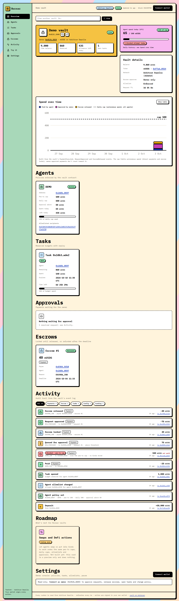

# Bursar dashboard (`web/`)

Vite + React + TypeScript + [viem](https://viem.sh), with plain custom CSS. Every number is read from the chain. **The app holds no keys:** reads go through a public RPC, and writes are signed in the visitor's own browser wallet (the injected EIP-1193 provider, `window.ethereum`).

| Route | Page |
|---|---|
| `/dashboard` | The demo vault: live state for everyone, plus the **owner console** when the connected wallet owns the vault |
| `/dashboard?vault=0x…` | The same view for any Bursar vault on Arbitrum Sepolia |
| `/try` | **Playground:** create your own vault and run agent scenarios against it (testnet sandbox, mock token) |
| `/` | Reserved for the landing page; currently redirects to `/dashboard` |



## Run

```bash
cd web
npm install
npm run dev        # http://localhost:5173/dashboard
npm run build      # typecheck + production build into dist/
npm run preview    # serve the production build
```

On Windows PowerShell, use `npm.cmd` if `npm` is blocked by the script execution policy.

## Wallet connection

[wagmi](https://wagmi.sh) on top of viem, with our own connect modal built from the design system (no third-party modal UI):

- **Browser wallets:** every wallet found through EIP-6963 (MetaMask, Rabby, Coinbase Wallet, Brave…) gets its own entry with its own name and icon. A generic "browser wallet" entry appears only for a plain `window.ethereum` that doesn't announce itself.
- **WalletConnect:** for mobile and non-installed wallets. The QR code renders in our modal. Needs `VITE_WALLETCONNECT_PROJECT_ID`; without it the option is hidden and the console logs a warning.
- **Coinbase Wallet:** the extension or a smart wallet.
- **No wallet installed:** the modal shows install links for MetaMask and Rabby.

After connecting:
- **Network:** the app asks to switch to Arbitrum Sepolia (chain 421614); wagmi adds the network if the wallet doesn't know it. A banner stays up while the wallet is on another network.
- **Header:** the short address, the ETH balance, and **Disconnect**, which closes every connection.
- **Persistence:** the last-used wallet reconnects on reload. Its storage is wrapped so it never throws.
- **Live updates:** account and network changes take effect immediately.
- **Rejections:** a rejected request reads "Request rejected in your wallet."

## Owner console (Stage B)

Connect a wallet (see above).

- **Owner:** actions appear inline and in the owner console.
  - **Approval queue:** approve or reject pending requests.
  - **Escrows:** release them (also allowed for the approver), or refund them once past their deadline (anyone can).
  - **Tasks:** open a task (id = `keccak256(label)`) or close one.
  - **Agents:** register or update a policy; revoke an agent.
  - **Allowlists:** add or remove recipients per agent or vault-wide, and toggle enforce-allowlist.
  - **Settings:** escrow approver, request TTL, pause and unpause.
- **Anyone else:** the page stays read-only, with a hint naming the owner address to connect as.

Every action follows the same steps:

1. **Simulate** with `eth_call` as your address. If the vault would revert, nothing is sent. The UI shows the decoded custom error, e.g. `InsufficientFreeBalance()` or `ExceedsPerTxCap()`.
2. **Sign** in your wallet. The status shows *Confirm in wallet*.
3. **Pending**, then **Confirmed**, with the transaction linked on Arbiscan. The page then re-reads the vault immediately.

Destructive actions (pause, revoke, close task) ask for a second click to confirm.

## Playground (Stage C, `/try`)

A **testnet sandbox with a mock token and no real funds**, where a visitor drives their own vault with their own wallet. The deployer's demo vault is never touched from here.

1. **Connect:** connect and switch network. The page shows your ETH balance, with faucet links if it's below 0.0005 ETH.
2. **Create and fund:** create your own vault through `BursarFactory.createVault(MockUSDG)`, mint mock USDG to yourself, then approve and deposit. Your vaults are listed from the factory (`vaultsOf`), and the last one you used is remembered in localStorage, so you can come back to it.
3. **Become an agent:** register your own address as an agent, with an editable policy (default 100 / 500 / 50). Allowlist a recipient (a random address with no known key, by default), and open a task.
4. **Scenarios:** each card pre-fills an agent action, explains what it shows, runs it, and decodes the result from the transaction's events:
   - **A. Buy data:** a direct payment within every limit.
   - **B. Hire a sub-agent:** an escrow to another address, then released by you as owner.
   - **C. Pay a human bounty:** an escrow to a person (editable address), released when you approve the work.
   - **D. Over-limit attempt:** above the per-tx cap. Simulated first and shown as blocked with `ExceedsPerTxCap()`; nothing is signed or sent.
   - **E. Needs approval:** above the threshold, or to a non-allowlisted address. It lands in the approval queue, and you approve or reject it.

Your vault's live state (balances, policy, task budget, queue, escrows, activity) sits next to the scenarios. Scenario amounts are derived from your current policy.

## Configuration

Copy `.env.example` to `.env.local`. Only `VITE_`-prefixed variables reach the browser, and everything in them is bundled into public JavaScript, so **never put a key or secret here**. This app doesn't need one.

| Variable | Default | Purpose |
|---|---|---|
| `VITE_RPC_URL` | `https://sepolia-rollup.arbitrum.io/rpc` | Primary JSON-RPC endpoint |
| `VITE_RPC_FALLBACK_URL` | `https://arbitrum-sepolia-rpc.publicnode.com` | Used only when a primary request fails; set to empty to disable |
| `VITE_POLL_MS` | `6000` | Refresh interval |
| `VITE_WALLETCONNECT_PROJECT_ID` | (none) | Enables WalletConnect; put it in `web/.env` (git-ignored) |

The fallback exists because the official public endpoint occasionally returns a malformed CORS header (`Access-Control-Allow-Origin: *,*`) to browsers. Those requests fail in the browser even though they work from `curl`. With the fallback, a failed request is retried on the second endpoint, so the page keeps updating. The browser console still logs the rejected responses.

## Where the data comes from

- **Addresses:** `../deployments/arbitrum-sepolia.json`, imported at build time. Vite is allowed to read only that folder outside `web/`.
- **ABIs:** `src/abi.ts`, generated from Foundry's compiled artifacts. After changing the contracts, run `forge build` in the repo root, then `npm run abi`.
- **Live state:** `src/lib/useVault.ts` polls every `VITE_POLL_MS`, for whichever vault is selected:
  - **Start block:** the vault's creation block, found from the factory's `VaultCreated` event (the demo vault's is known).
  - **State reads** (owner, paused, balances, policies, tasks, requests, escrows) are batched into multicall3 requests.
  - **Vault event logs** start at the vault's deploy block, then only new blocks are fetched. They drive the activity feed and let the dashboard discover agents, allowlisted recipients and tasks; the current state of each is then read on-chain.
  - **Block timestamps** for the feed are cached.
- **Countdowns and the "expired" flags** use the latest block timestamp, ticking locally between refreshes.

Amounts are shown in human units (6 decimals) with thousands separators. Hover any amount to see its raw base-unit value. If the RPC fails, the page keeps the last good data, shows an error banner, and turns "last updated" amber.

## Design system

`src/styles/design-system.css` (tokens and base styles) and `src/components/ds.tsx` (Card, Badge, Button, SectionBar, Stat, KV, Table) are shared, so the landing page can reuse them.

- **Colors:** black `#000`, page `#F2F2F2`, card `#FFF`, lime `#D4FF00`, amber `#FFC148`, green `#00D46E`, blue `#0352A1`, gray `#465063`.
- **Font:** JetBrains Mono from Google Fonts, with tabular numbers.
- **Shapes:** square corners, 4px black borders, and no shadows or gradients.
- **Tables:** collapse into labelled blocks below 760px.
- **Accessibility:** keyboard focus is always visible as a 3px blue outline.

## Code map

| Path | What |
|---|---|
| `src/lib/chain.ts` | Network, deployment addresses, public read client (with RPC fallback) |
| `src/lib/wallet.tsx` | Injected-wallet connection, account and network tracking, switch/add Arbitrum Sepolia |
| `src/lib/tx.ts` | `useTx()`: simulate → sign → wait, with custom-error decoding |
| `src/lib/useVault.ts` | Live vault reader (state + event history), with `refresh()` |
| `src/components/ds.tsx`, `styles/design-system.css` | Design system |
| `src/components/web3.tsx` | Wallet button, tx status line, confirm button, form field |
| `src/components/vault/panels.tsx` | Vault panels with inline owner/approver actions |
| `src/components/vault/OwnerConsole.tsx` | Owner forms |

## End-to-end tests

`scripts/e2e/` drives the real app in headless Chrome against Arbitrum Sepolia, with **a throwaway test wallet**:

- **Test-only wallet:** a `window.ethereum` shim is injected into the page (it isn't part of the app). It forwards wallet requests to Node, which signs with a key read from a file outside the repo (`BURSAR_TEST_WALLET_FILE`, the JSON from `cast wallet new --json`).
- **No key in the page:** the key never enters the page or the build, and the scripts never print it.
- **Funding:** the throwaway wallet needs a little Arbitrum Sepolia ETH.

```bash
npm run dev    # in one terminal
BURSAR_TEST_WALLET_FILE=/path/outside/repo/wallet.json node scripts/e2e/stage-b.mjs
```

- **The test wallet:** the shim announces itself through EIP-6963, the same way a real extension does. `wallet-modal.mjs` announces two test wallets to check the modal lists both.
- **`wallet-modal.mjs`:** the modal listing, a rejected request, connecting with the network switch and balance, reconnecting after reload, and disconnecting. Saves `docs/screenshots/wallet-modal-*.png`.
- **`stage-c.mjs`:** the whole playground through the UI. It creates a vault, mints, approves and deposits, sets up the agent, allowlist and task, then runs scenarios A–E (including a blocked attempt, one approval and one rejection) and checks the vault is remembered after a reload. Saves `docs/screenshots/playground-*.png`.

`stage-b.mjs` first seeds a fresh vault owned by the test wallet, with funds, an agent, a task, two queued requests and two escrows. It then uses only the UI to run every owner action: approve, reject, release, a decoded-error attempt, open and close a task, update the policy, allowlist, enforce-allowlist toggle, approver, TTL, pause and unpause, refund, and revoke. It saves screenshots to `docs/screenshots/stage-b-*.png`.

## Screenshots

`docs/screenshots/` holds full-page captures at desktop (1440px) and phone (390px, 2×) widths, taken from the running app against the live vault. To regenerate them while `npm run dev` is running:

```bash
node web/scripts/screenshot.mjs http://localhost:5173/dashboard docs/screenshots/dashboard-desktop.png 1440 1 false
node web/scripts/screenshot.mjs http://localhost:5173/dashboard docs/screenshots/dashboard-phone.png 390 2 true
```

The script drives a local Chrome through the DevTools protocol, so it emulates a true phone viewport. Plain `--headless --window-size` can't go below about 500px on Windows. Set `CHROME_PATH` if Chrome isn't in its default location.
